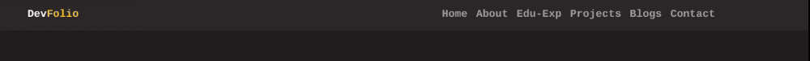
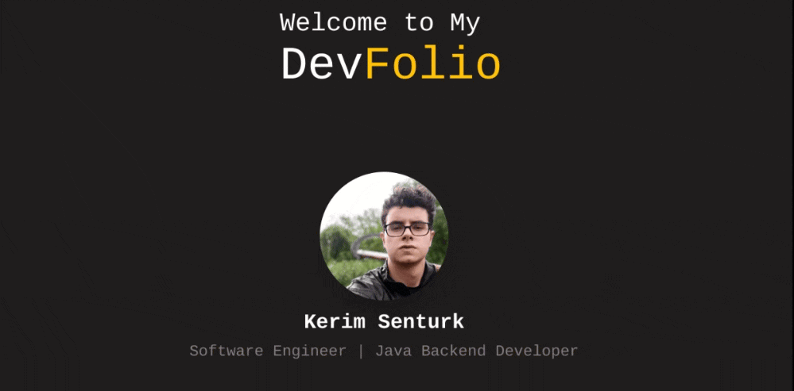
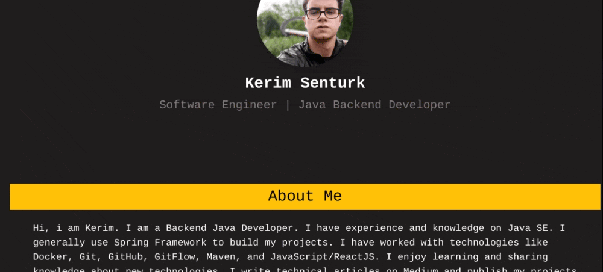
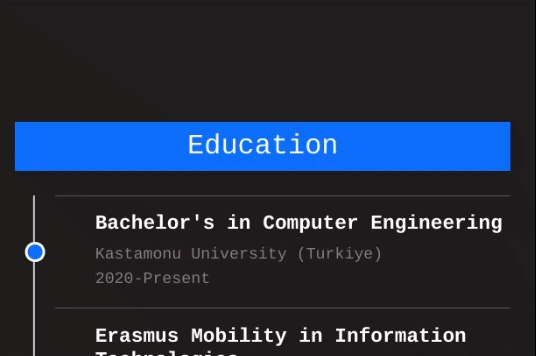
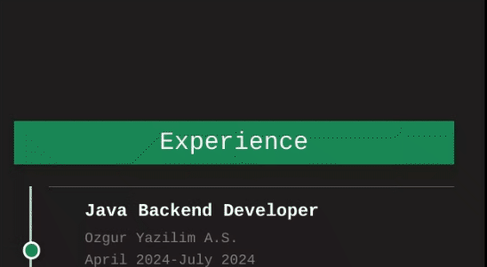

<div align="center">
   

  **v1.0**
  [**Turkish**](docs/README_tr.md) - [**English**](README.md)
  <hr>
</div>

DevFolio allows you to easily create a simple, clean portfolio site. Developed especially for software developers, this project is a simple web interface where users can showcase their personal information, career information, blog content and projects they have developed. **DevFolio** is developed using basic HTML, CSS and JavaScript and can be easily configured and prepared. It can also be customized and new sections, cards, labels etc. can be added upon request.

You can access the demo application [**here**]().

## Features


### 1. Navigation Bar

It contains links that will allow you to quickly navigate to the sections and titles created on the portfolio. Configuration is also required here for newly added portfolio sections.



### 2. Hero Section

This is the section that contains the user's profile. We display information such as user picture, name, surname, position, title here.



### 3. About Me

This is the section where we briefly introduce ourselves.



### 4. Education

This is the section where we display educational information as staged.



### 5. Experience

This is the section where we gradually display our work experience information. We can display the tools or skills we use in our experiences with labels here.



### 6. My Projects

This is the section where we briefly introduce the projects we have developed. With its card structure, it contains project title, project description, project image, and project link fields for each project.


### 7. My Blogs

This is the section where we introduce the blogs we write. The data here is taken from the Medium RSS Feed by default.


We have three different way to configure the data represented in here:

- **Default:** You use the default method and simply replace the Medium RSS Feed URL with your own.

```JavaScript
~script.js

6-  const rssFeedUrl = "https://medium.com/feed/@yourmediumusername";
```

- **Using Different RSS Feed Service:** You pull information from an RSS source other than Medium and update the RSS Feed URL and parse the content according to the blog card.

- **Static:** You can add it statically without using any external resources. To do this, you create the content of the blog cards manually using the existing design.

```html
~Blog Card Template
<div class="col-md-4">
  <a href="${link}" class="text-decoration-none" target="_blank">
    <div class="card">
      
      <div class="card-body">
        <h5 class="card-title">${title}</h5>
        <p class="lite-text">${pubDate}</p>
      </div>
    </div>
  </a>
</div>
```

### 8. Contact Me

This is the section that allows other users viewing our portfolio to communicate with us. Here we show information such as email, social media, location. It also contains a form for other users to quickly send us an email. With the information here, an auto-mail draft is created and directed to the relevant address with _mailto::_ support.


### 9. Responsive View

The application can be displayed properly on screens of different sizes.

**_Note:_** _It has not been tested sufficiently for different sizes. Some visual issues are possible. It is intended to be tested in new versions._


## Targeted Features in the New Version (v1.1)


- **Dynamic Data Management**
  It is aimed to provide dynamic data configuring where users can more easily manage portfolio information such as experience, education, and about me.

- **Oto CV Generation**
  The aim is to automatically create a CV document using the information provided by users on the portfolio and download it as a file.

- **Pre-Defined Technology Badges**
  The labels we use in the My Projects and Experience sections are intended to be predefined for technologies such as Java, Go, MySQL, Docker, etc. for ease of use. In this way, labels for commonly used technologies can be easily displayed.

## Built With


- **HTML/CSS**
- **JavaScript**
- **Bootstrap 5.3.3**
- **Bootstrap Bundle 5.3.0**
- [**Colors CSS 3.0.0**](https://github.com/mrmrs/colors)

## Contribution
If you want to contribute to this project, you can follow the steps below:

1. **Fork** the repository.

2. Create a new **branch**:
```bash
git checkout -b feature-isim
```
3. **Commit** your changes:
```bash
git commit -m "Commit Message"
```
4. **Push** your changes:
```bash
git push origin feature-isim
```
5. You can send your contribution by creating a **Pull request**!

<hr>

This project is licensed under the [MIT License](LICENSE).